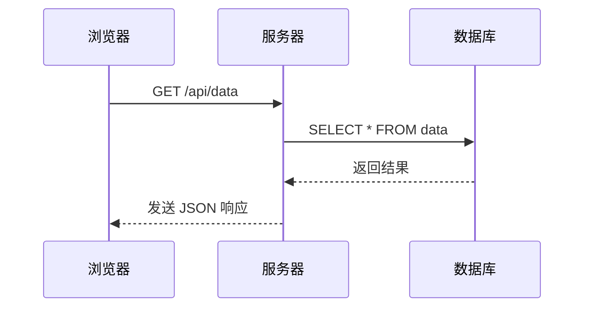

# 关于本站

本站使用 VitePress 构建，托管于 GitHub Pages。

## 提交你的文档

如果你想为本站贡献文档，可以通过向管理者发送讯息来进行。我们欢迎任何形式的贡献，包括但不限于：

- 修复错误
- 改进文档
- 添加新内容

请你继续阅读以下内容，感谢你的支持与贡献！

## 文档要求

请使用 Markdown 格式编写你的文档。注意：

- 行内代码请使用单个反引号（`` ` ``）包裹，代码块请使用三重反引号（` ``` `）包裹。**Mermaid 代码块除外**，具体见后文。
- 行内公式请使用美元符号（`$`）包裹，行间公式请使用双美元符号（`$$`）包裹。
- 插入图片时**请使用Base64编码的图片**，避免使用外链图片，具体见后文。
- 请确保文档结构清晰、层次分明。
- 请使用适当的标题和子标题来组织内容，一级标题（`#`）不会在页面导航中显示，因此**请将一级标题作为整个文档的大标题使用**，或**不使用一级标题**。

### 在文档中插入图片

为了便于管理，请使用以下语法插入图片：

在你的文档正文部分，使用

```markdown
![图片描述][图片标识符]
```

在文档末尾，预留出一个图片引用定义区，存放所有图片的 Base64 编码，按以下格式：

```markdown
[图片标识符1]: data:image/png;base64,...

[图片标识符2]: data:image/jpeg;base64,...

...
```

### 在文档中显示 Mermaid 图表

[Mermaid](https://mermaid.js.org/) 是基于 JavaScript 的图表工具，可渲染 Markdown 启发的文本定义以动态创建和修改图表。

若要在文档中显示 Mermaid 图表，**请使用三重反引号包裹的 Mermaid 代码块**，例如：

<pre>

</pre>

会显示为：


### 在文档中显示 Iconify 提供的图标

本站文档支持使用 [Iconify](https://iconify.design/) 提供的图标。你可以通过以下方式在文档中插入指定图标：

```html
这包含一个 <Icon icon="devicon-plain:html5"/>HTML 标签。
可以直接在 Icon 组件中使用 href 属性，就像 <Icon icon="devicon-plain:githubcodespaces" href="https://github.com/vuejs/vitepress"/> 这样。
```

显示效果：

> 这包含一个 <Icon icon="devicon-plain:html5"/>HTML 标签。
> 可以直接在 Icon 组件中使用 href 属性，就像 <Icon icon="devicon-plain:githubcodespaces" href="https://github.com/vuejs/vitepress"/> 这样。

注意：由于本站支持明亮/黑暗主题切换，为确保可视性，**请使用单色图标（Monotone）**，慎用彩色图标。
